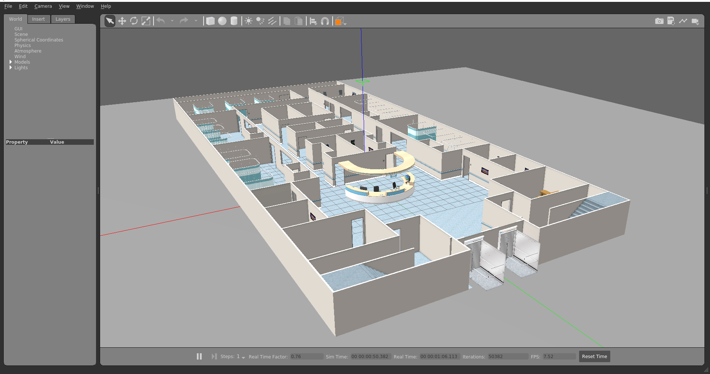

# ♿️ Gazebo docker hospital 🐳

> A repository to try to use docker in a hospital world in gazebo

## 💥 how to use

First of all, you'll need to have docker in your computer, and that's it !

To generate your docker image, run the follower command:

```bash
docker build . -t hospital_world
```

To execute your docker image and open a container, run the following command:

```bash
chmod +x ./run.sh
./run.sh
```
Inside of your container, just run:

```bash
roslaunch d_hospital_world view_hospital.launch
```

## 🧐 What we should see?

